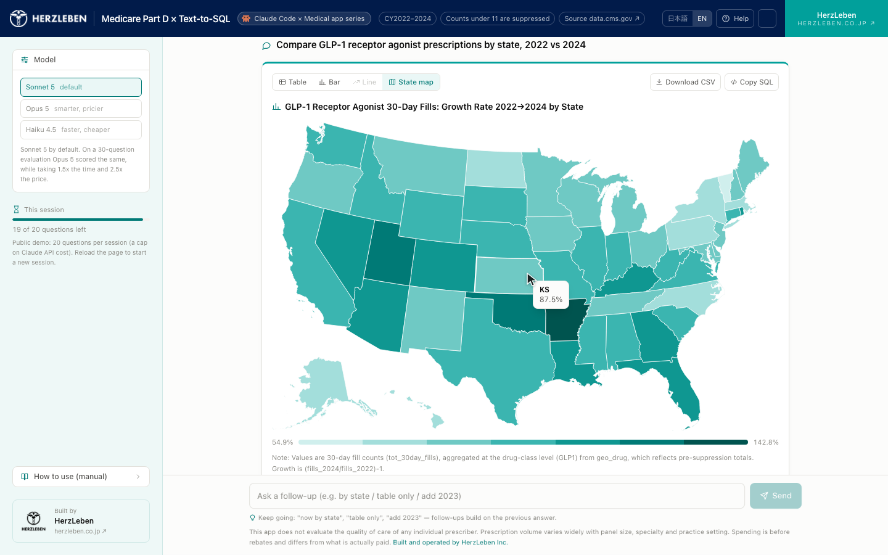

# Medicare Part D × Text-to-SQL

米国 CMS の公開データ「Medicare Part D Prescribers」（CY2022–2024、**8,481万行**）を、
日本語（または英語）の質問から SQL を生成して探索するアプリ。Claude の tool use で
「SQL を書く → BigQuery で実行する → グラフの仕様を決める → 結果を解釈する」を回す。

> **English summary** — A text-to-SQL app over the public CMS *Medicare Part D Prescribers*
> dataset (CY2022–2024, 85M rows). Claude writes and self-corrects SQL, BigQuery runs it, and
> the answer comes back as a table, a chart (bar / line / state choropleth) and a short reading.
> Run it locally with your own Anthropic API key and Google Cloud project. Deploy to Cloud Run
> is optional and invite-only. MIT licensed; the data is not in this repo.

ブログ連載「Claude Code × Medical app series」第 1 弾。コードは MIT、**データはこのリポジトリに
含まれない**（`data/download.sh` が CMS から取得する）。
ホスト版は招待制で一般公開していないので、**自分の環境で動かす前提**。

2 分の紹介動画：[日本語字幕](https://youtu.be/_HJs8jPskwA) / [English subtitles](https://youtu.be/6-UHYb1T_qU)

<p></p>

```
質問（日本語 / 英語）
  → Claude が run_sql を呼ぶ（SQL 生成）
  → ガード検査 → dry-run → BigQuery 実行（上限 2 GiB / 60秒 / 先頭1000行）
  → 0行やエラーなら Claude が書き直す（最大3回）
  → Claude が plot_spec を呼ぶ（グラフ種別と軸）
  → 解釈と次の質問を SSE で逐次配信
```

## 自分の環境で動かすときに変えるもの

| 項目 | どこ | 値 |
|---|---|---|
| **Anthropic API キー** | `.env` の `ANTHROPIC_API_KEY` | [console.anthropic.com](https://console.anthropic.com/) で発行 |
| **GCP プロジェクト ID** | `.env` の `GCP_PROJECT` | BigQuery を置くプロジェクト。課金アカウント紐付け済み |
| モデル | `.env` の `ANTHROPIC_MODEL` | 既定 `claude-sonnet-5` |
| リージョン | `.env` の `RUN_REGION` | Cloud Run を使う場合のみ。既定 `us-central1` |
| サービス名 | `.env` の `RUN_SERVICE` | 同上。既定 `medicare-partd-text-to-sql` |
| 見せたい人 | `./deploy.sh --run --invite <email>` | 同上。招待した Google アカウントだけが開ける |

`.env.example` に全項目の説明がある。**キーとプロジェクト ID 以外は既定のままで動く。**
コードに自分の値を書く場所は無い。

## 構成

| ディレクトリ | 中身 |
|---|---|
| `app/` | エージェント本体。`agent.py`（ツールループ）、`tools.py`（run_sql / plot_spec）、`guards.py`（SQL 検査）、`prompts/` |
| `api/` | FastAPI。エージェントの経過を SSE で流すだけ |
| `web/` | Next.js 16 + TypeScript + Tailwind v4。Recharts と d3-geo で描画 |
| `data/` | CMS からの取得（`download.sh`）、前処理（`preprocess.py`）、BigQuery 投入（`load.sh`）、列定義（`schema/*.json`） |
| `sql/` | `ddl.sql`（schema JSON から生成）、`seed_state.sql`、`seed_drug_class.sql` |
| `eval/` | 精度評価セット |
| `docs/` | 設計書、データ辞書、設計上の判断、精度評価、スクリーンショット |

Next.js が `/api/*` を FastAPI にプロキシする。Docker では1コンテナに同居させる。

## 必要なもの

- Python 3.12 / Node 22 以上 / `gcloud` CLI
- Google Cloud プロジェクト（BigQuery 有効、課金アカウント紐付け済み）。データ投入者には
  `roles/bigquery.admin` と `roles/storage.admin` 相当が要る
- Anthropic API キー

## セットアップ

```bash
# 1. Python
python3.12 -m venv .venv
.venv/bin/pip install -r requirements.txt

# 2. フロント
cd web && npm install && cd ..

# 3. 設定
cp .env.example .env      # ANTHROPIC_API_KEY と GCP_PROJECT を書く（上の表）

# 4. GCP 認証（BigQuery を叩くのに要る）
gcloud auth login
gcloud auth application-default login
gcloud config set project <PROJECT>
gcloud auth application-default set-quota-project <PROJECT>
```

## データ投入（初回のみ、1〜2時間）

```bash
./data/download.sh              # CMS から CSV を取得（3データセット × 3年、約10.5GB）
.venv/bin/python data/preprocess.py   # year 付与・型明示・Parquet 化（約2.2GB）
./data/load.sh --plan           # 実行されるコマンドを確認（課金なし）
./data/load.sh --run            # BigQuery に投入（★GCS と BigQuery に課金が発生する）
```

投入されるもの:

| テーブル | 行数（3年） | 内容 |
|---|---:|---|
| `partd.provider_drug` | 80,688,291 | 年 × 医師(NPI) × 薬剤 |
| `partd.provider` | 4,129,857 | 年 × 医師のサマリ（84列） |
| `partd.geo_drug` | 348,993 | 年 × 地域 × 薬剤 |
| `partd.drug_class` | 204 | 一般名 → 薬効クラス（17クラス） |
| `partd.state` | 62 | 州略号 ↔ 州名 ↔ FIPS |

BigQuery ストレージは論理 19.93 GB（無料枠 10 GiB を超える分で月 約30円）。

データセットに既定の表有効期限が付いていると、投入した表が 60 日後などに黙って消える（実際に踏んだ）。投入前に `bq show --format=prettyjson <PROJECT>:partd | grep -i expiration` で確認し、付いていれば `bq update --default_table_expiration 0 <PROJECT>:partd` で外す。投入後は `/verify-data`（下の skill）が期限の有無も見る。

## 開発用の BigQuery MCP（Claude Code から投入結果を確かめる）

Claude Code で開発するときに、テーブル一覧・スキーマ・行数の確認を BigQuery コンソールに行かずに済ませるための接続。
アプリ本体は使わない（アプリは `google-cloud-bigquery` で直接叩く）。

- サーバー：[MCP Toolbox for Databases](https://github.com/googleapis/mcp-toolbox)（Google 公式 OSS）
- 設定：`.mcp.json`（プロジェクトスコープ。Claude Code の起動時に承認を求められる）と `mcp/bigquery.tools.yaml`（読み取り専用・`partd` だけ・1 クエリ 2 GiB 上限・最大 100 行）
- 認証：ADC。`BQ_MCP_SA` に読み取り専用のサービスアカウントを指定すると、そのアカウントになりすまして実行する（鍵ファイルは作らない）

```bash
brew install mcp-toolbox                      # macOS。他 OS は上のリンクの Releases から
gcloud auth application-default login

# 読み取り専用のサービスアカウント（推奨。省略すると自分の ADC の権限でそのまま動く）
PROJECT=<your-project>
SA=partd-mcp-reader@$PROJECT.iam.gserviceaccount.com
gcloud iam service-accounts create partd-mcp-reader --project=$PROJECT --display-name="BigQuery MCP reader (partd read-only)"
gcloud projects add-iam-policy-binding $PROJECT --member="serviceAccount:$SA" --role="roles/bigquery.jobUser" --condition=None
bq show --format=prettyjson $PROJECT:partd > /tmp/ds.json
python3 -c 'import json,sys;p="/tmp/ds.json";d=json.load(open(p));m=sys.argv[1];a=d.setdefault("access",[]);a.append({"role":"READER","userByEmail":m});json.dump(d,open(p,"w"))' $SA
bq update --source /tmp/ds.json $PROJECT:partd     # データセット単位の READER（bq add-iam-policy-binding --dataset は allowlist が要る）
gcloud iam service-accounts add-iam-policy-binding $SA --member="user:<your-account>" --role="roles/iam.serviceAccountTokenCreator"

# Claude Code を起動するシェルで
export GCP_PROJECT=$PROJECT BQ_MCP_SA=$SA
claude          # 起動時に .mcp.json の bigquery を承認 → /mcp で connected を確認
```

動作確認は「partd のテーブル一覧を出して」「provider_drug の年別の行数を数えて」で足りる。
`INSERT` / `CREATE` / `DELETE` はサービスアカウントの権限で 403、`partd` 以外のデータセットは Toolbox が拒否する。
IAM を付けた直後は反映に 1〜2 分かかる。

## Claude Code の skill（`.claude/skills/`）

人が毎回やっていた工程を skill にした。`/名前` で起動する。中身は Markdown 1 枚（`SKILL.md`）で、手順と「守ること」が書いてあるだけ。

| skill | 何をするか | 起動できるのは | 課金 |
|---|---|---|---|
| `/verify-data` | 投入結果の確認（5 表・NPI が STRING・年別行数・抑制の NULL）。上の MCP だけで動く | 人と Claude | BigQuery 数百 MB |
| `/eval` | 30 問の精度評価 → 前回との差 → `docs/EVAL.md` に記録 | 人だけ | Anthropic API（30 問で 8〜9 分） |
| `/deploy` | plan → 確認 → run → 配信リビジョンの確認 → スモークテスト → 記録 | 人だけ | Cloud Build / Cloud Run |

課金が出る 2 つは `disable-model-invocation: true` で、Claude が勝手に始められない。`/deploy` の中の `./deploy.sh --run` は権限ルール（ask）で必ず確認が出る。

## 起動

```bash
./run.sh              # 開発モード
./run.sh prod         # 本番相当（next build 済みを起動）
```

→ http://localhost:3000

最初の画面で質問例を押すか、中央の入力欄に書く。答えの上部で `表 / 棒 / 折れ線 / 州の地図`
に切り替えられる（SQL は再実行しない）。「使い方」ボタンにアプリ内マニュアル、`/data` に
データの説明がある。

CLI で1問だけ流すこともできる。

```bash
.venv/bin/python -m app.agent --question "GLP-1受容体作動薬の州別処方数を2022→2024で比較して"
```

## デプロイ（任意・招待制）

一般公開はしない。`--no-allow-unauthenticated` で立て、`roles/run.invoker` を付けた
Google アカウントだけがアクセスできる。URL を知っていてもブラウザで直接開けば 403 になる。

```bash
./deploy.sh --plan                          # 実行されるコマンドを確認（課金なし）
./deploy.sh --run                           # デプロイ（★課金が発生する）
./deploy.sh --run --invite 相手@gmail.com    # 見せたい人を追加
./deploy.sh --smoke                         # デプロイせず、今動いているものを検査
```

`--run` は最後にスモークテストを流す。**「URL が開くか」では足りない**ためで、
実際に1問投げて SQL 生成・BigQuery 実行・解釈のストリーミング・完了の4つが
揃い、既知の値（セマグルチドの処方医数 174,885）が返ることまで確認する。
失敗したら前のリビジョンに戻すコマンドとログの見方を表示して終了コード 1 で止まる。

見る側の開き方（`run.invoker` が付いている前提）:

```bash
gcloud run services proxy medicare-partd-text-to-sql --region=us-central1 --project=<PROJECT>
# → http://localhost:8080
```

実行用サービスアカウント `partd-app@` に付ける権限は3つだけ。プロジェクト全体の
Viewer や Editor は付けない。

| 権限 | 範囲 |
|---|---|
| `roles/bigquery.jobUser` | プロジェクト（ジョブ実行のみ。データは読めない） |
| `roles/bigquery.dataViewer` | **`partd` データセットのみ** |
| `roles/secretmanager.secretAccessor` | **`ANTHROPIC_API_KEY` のみ** |

Cloud Run の設定は min 0 / max 2 / concurrency 10 / 1 GiB / timeout 300s。
API キーは Secret Manager からのみ渡す（イメージにもコードにも含めない）。

GitHub の push で自動デプロイしたい場合は `cloudbuild.yaml` を使う。

## データの読み方（重要）

- **抑制**：件数 1〜10 は空欄（NULL）。**0 ではない**。集計時は `COUNTIF(x IS NULL)` を併記する
- **費用**：`tot_drug_cst` は薬剤費＋調剤料＋税で、プラン・患者・政府の支払合計。**リベート控除前**
- **薬剤名**：CMS 原文は Title Case（`Ozempic` / `Semaglutide`）。列幅の都合で切り詰められている
  （`Edoxaban Tosylate`、`Empaglifloz/Linaglip/Metformin`）ので、薬効クラスで絞るときは
  `partd.drug_class` を結合する。名前を並べると取りこぼす
- **カバー範囲**：Part D 加入者（Medicare 受給者の約8割。2024年は 6,700万人中 5,300万人。
  出典 [KFF](https://www.kff.org/medicare/key-facts-about-medicare-part-d-enrollment-premiums-and-cost-sharing-in-2024/)）の外来処方のみ
- **`geo_drug` と `provider_drug` の合計は一致しない**（前者は抑制前の全数集計）

## ガード

- SQL は `SELECT` / `WITH` で始まる1文のみ。複文・DDL・DML は拒否
- 参照できるのは `partd` の5テーブルだけ（テーブル名まで許可リストで固定）
- `SELECT *` は拒否。修飾なしのテーブル参照も拒否
- dry-run で見積もり 2 GiB 超なら実行しない。実行時も `maximum_bytes_billed` で止める
- タイムアウト 60 秒、結果は先頭 1000 行
- 1セッション 20 質問

`maximum_bytes_billed` は **dry-run の見積もりに対して効く**。クラスタリングの枝刈りは
見積もりに反映されないため、実測 27 MB のクエリでも見積もりは 1.3 GB になる。
1 GiB では通らないので 2 GiB にしてある（詳細は `docs/DECISIONS.md`）。

## モデル

`ANTHROPIC_MODEL` で指定する。既定は `claude-sonnet-5`。UI から Haiku 4.5 に切り替えられる。

Sonnet 5 以降は `temperature` が廃止されているため送っていない
（送ると 400）。代わりに `output_config={"effort": "medium"}` を使う。

### Vertex AI 経由にする場合

`anthropic` SDK を `AnthropicVertex` に差し替える。`app/agent.py` の
`anthropic.Anthropic()` を `anthropic.AnthropicVertex(project_id=..., region=...)` にして、
`pip install "anthropic[vertex]"` を入れ、`ANTHROPIC_API_KEY` の代わりに GCP の
Application Default Credentials を使う。モデル ID は接頭辞なしの `claude-sonnet-5` のまま。

## コスト

| 項目 | 実測・見積もり | 月額 |
|---|---|---|
| BigQuery ストレージ | 論理 19.93 GB | 約30円 |
| BigQuery クエリ | 1質問あたり 10〜1,400 MB | 0円（1TB 無料枠内） |
| Anthropic API | 初回 約9円 / 2問目以降 約4.5円 | 質問数次第 |

システムプロンプトは 11,959 トークン。`cache_control` を付けているので2ターン目以降は
入力の 0.1 倍単価で読まれる。

## ドキュメント

| ファイル | 内容 |
|---|---|
| `docs/design.md` | 設計書。アーキテクチャ、DDL、ツール定義、ガード、画面 |
| `docs/data_dictionary.md` | CMS 公式データ辞書の日本語対訳（列名・型・抑制ルールの正本） |
| `docs/DECISIONS.md` | 設計上の判断と、踏んだ落とし穴の要約 |
| `docs/EVAL.md` | 精度評価。30 問の最新結果と履歴 |
| `docs/screenshots/` | 画面（記事用） |
| `CLAUDE.md` | Claude Code に渡している開発指示。同じ手順で続きを作れる |

## ライセンスと出典

### コード

MIT License（`LICENSE`）。商用利用・改変・再配布ができる。

`web/public/brand/` のロゴ（HerzLeben のロゴマーク・ロゴタイプ）は株式会社ヘルツレーベンの商標であり、MIT の対象外。フォークや派生物では差し替えること。

### データ

**このリポジトリにデータは含まれない。** `data/download.sh` が実行時に data.cms.gov の
DCAT カタログ（`https://data.cms.gov/data.json`）から URL を解決して取得する。
取得先の `data/raw/` と `data/parquet/` は `.gitignore` 済み。

CMS が同カタログで宣言している条件は次の通り（3データセットとも同一、2026-09 時点）。

| 項目 | 値 |
|---|---|
| `license` | `https://www.usa.gov/government-works`（米国政府著作物） |
| `accessLevel` | `public` |
| `rights` | 指定なし |
| `publisher` | Centers for Medicare & Medicaid Services |
| `temporal` | CY2013-01-01 〜 CY2024-12-31 |

米国政府の著作物は米国内で著作権の対象外であり、利用に制限はない。これらは
非識別化済みの Public Use File で、Data Use Agreement の締結も求められていない。

ただし米国政府データの通例として、次の2点は守る。

- **出典を示す**
- **CMS や米国政府による推奨・承認を示唆しない**

出典表記の例:

> 出典：Centers for Medicare & Medicaid Services, *Medicare Part D Prescribers*
> (CY2022–2024). https://data.cms.gov/

### 派生データ

| ファイル | 由来 | 扱い |
|---|---|---|
| `sql/seed_drug_class.sql` | CMS の `gnrc_name`（2,109種）から語幹一致で生成した一般名→薬効クラス対応（204行・17クラス） | 本リポジトリの著作物。MIT に含まれる |
| `sql/seed_state.sql` | 州略号 ↔ 州名 ↔ FIPS | 同上 |
| `docs/data_dictionary.md` | CMS 公式データ辞書の日本語対訳 | 訳は本リポジトリの著作物。原典は米国政府著作物 |
| 州境界の TopoJSON | npm の `us-atlas`（ISC）。原典は US Census Bureau の TIGER/Line | ISC。原典は米国政府著作物 |

### 依存ライブラリ

すべて permissive ライセンスで、コピーレフトのものは含まない。

| | ライセンス |
|---|---|
| Next.js / React / Recharts / Tailwind CSS | MIT |
| d3-geo / topojson-client / us-atlas | ISC |
| TypeScript | Apache-2.0 |
| FastAPI / anthropic / PyYAML / DuckDB | MIT |
| uvicorn / pandas / python-dotenv | BSD |
| google-cloud-bigquery / pyarrow / db-dtypes | Apache-2.0 |

### 注意

ここに書いたのは公開されている条件を確認して整理したものであり、法的助言ではない。
自社での利用にあたって判断が必要な場合は、専門家に確認すること。

## 作った人

株式会社ヘルツレーベン（[herzleben.co.jp](https://herzleben.co.jp/)）。Claude Code で作った過程はブログ連載
「Claude Code × Medical app series」に書いている。

## 免責

本アプリは個々の医師の医療の質を評価するものではない。処方数の多寡は担当患者数・専門・
診療形態によって大きく変わる。費用はリベート控除前で、実際の支払額とは異なる。

出典：[CMS Medicare Part D Prescribers](https://data.cms.gov/provider-summary-by-type-of-service/medicare-part-d-prescribers)
